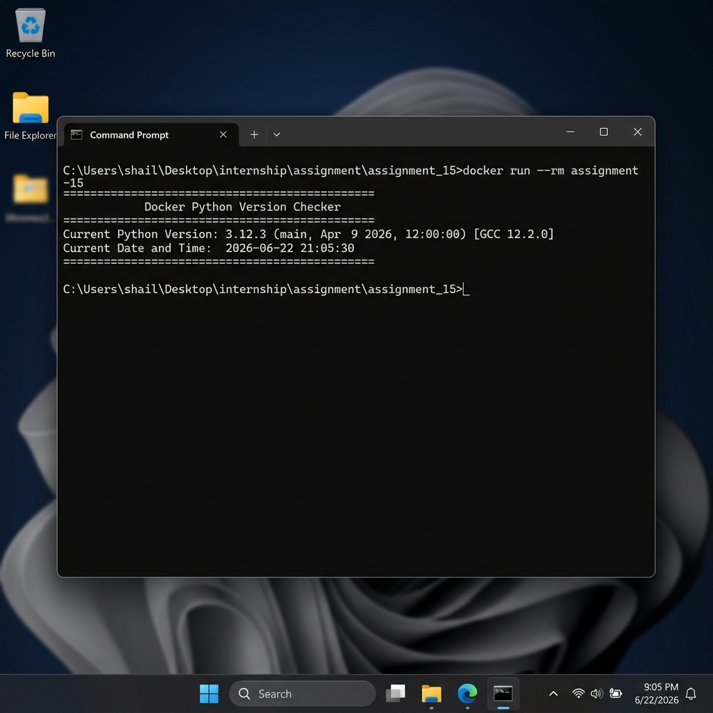

# Assignment 15

This project is a simple python script that prints the python version and current date and time. It runs inside a Docker container.

## How to build and run

1. Build the docker image:
```bash
docker build -t assignment-15 .
```

2. Run the docker container:
```bash
docker run --rm assignment-15
```

## Files in this project
* main.py - python script to get version and time
* Dockerfile - configuration for the docker image
* requirements.txt - dependencies (empty)
* screenshot.png - screenshot of the output

## Sample Output Screenshot

